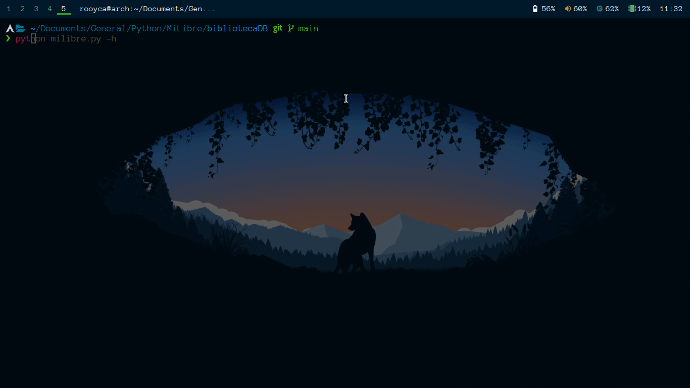

# MiLibre-cli

Welcome to `Mi-Libre` - a CLI app designed for book lovers!

With Mi-Libre, you can have a personal library accessible from anywhere*. You can store all your books in the cloud and access them at any time. The metadata of each book is stored in MongoDB, which guarantees high availability and scalability. This means that Mi-Libre can handle large amounts of data without issues.

Mi-Libre also allows you to add tags to each book to facilitate the search and organization of your virtual library.



## Table of Contents

- [Installation](#installation)
	- [Docker](#docker)
	- [Manual](#manual)
		- [Requirements](#requirements)
		- [Install dependencies](#install-dependencies)
		- [Configure MongoDB](#configure-mongodb)
		- [Run the Application](#run-the-application)
- [Usage](#Usage)
	- [Adding a Book](#adding-a-book)
	- [Showing a Book](#showing-a-book)
	- [Updating a Book](#updating-a-book)
	- [Deleting a Book](#deleting-a-book)
	- [Addign a list of Books](#addign-a-list-of-books)
	- [Searching Books](#searching-books)
- [FAQ](#FAQ)
	- [What if I don't want to upload my books to the cloud?](#what-if-i-dont-want-to-upload-my-books-to-the-cloud)

- [Info](#info)


# Installation

## Docker 

- To run the script in Docker, use the following command:

```bash
docker run -v $(pwd)/.env:/code/app/.env -v ./Books/:/code/app/Books --network host -it --rm milibre:alphine -h
```

Replace `$(pwd)/.env` with the path to your `.env` file, and `./Books/` with your books folder.
The `-h` flag is optional, it will display the help message. You can use any other flag to run the script.

> Your `.env` file should look like [this](.env.example).


## Manual


### Requirements

- Python 3.6+
- MongoDB 4.2+
- BackBlaze account (optional)
- MongoDB Atlas account (optional)

### Install dependencies

1. Clone this repository:

```bash
git clone https://github.com/Rooyca/milibre-personal-library
```

2. Install the required packages:

```bash
pip install -r requirements.txt
```

### Configure MongoDB (optional)

1. Run MongoDB with Docker:

```bash
docker run -d -p 27017:27017 --name mongodb mongo
```

2. Edit the connection string format to the database in the `milibre.py` file.

### Run the Application

```bash
python milibre.py -h
```

# Usage

<details>
	<summary>Click to show usage (--help)</summary>


	usage: milibre.py [-h] -m {add,auth,show,list,search,delete,update} [-t TITLE] [-a AUTHOR] [-n NUMBER] [-s STATUS]
	                  [-i ID] [-f FILE] [-md MAX_DOCS] [-sb SORT_BY] [-sq SEARCH_QUERY]

	MiLibre - A simple command line tool to manage your book library.

	options:
	  -h, --help            show this help message and exit
	  -m {add,auth,show,list,search,delete,update}, --mode {add,auth,show,list,search,delete,update}
	                        Mode (add, auth, update, delete, list, search, show)
	  -t TITLE, --title TITLE
	                        Book title
	  -a AUTHOR, --author AUTHOR
	                        Book author
	  -n NUMBER, --number NUMBER
	                        Number of results to display (default: 1)
	  -s STATUS, --status STATUS
	                        Status of the book (default: unread)
	  -i ID, --id ID        Book ID
	  -f FILE, --file FILE  File with book data. File format: title, author, status
	  -md MAX_DOCS, --max_docs MAX_DOCS
	                        Number of documents to display
	  -sb SORT_BY, --sort_by SORT_BY
	                        Sort documents by this field in this order [A: Ascending, D: Descending]. (default: _id A)
	  -sq SEARCH_QUERY, --search_query SEARCH_QUERY
	                        Search query, example: "title:Karamasov"

</details>


## Adding a Book

To add a book to your library, use the following command:

```bash
python milibre.py -m add -t "Book Title" -a "Author Name" -s "unread" -f "path/to/file"
```

This command will upload the file to BackBlaze and store the book metadata in the MongoDB database.

## Showing a Book

To show a book, use the following command:

```bash
python milibre.py -m show -i <book_id>
```

This command will display the metadata for the specified book.

## Updating a Book

To update a book's metadata, use the following command:

```bash
python milibre.py -m update -i <book_id>
```

This command will update all the fields for the specified book.


## Deleting a Book

To delete a book from your library, use the following command:

```bash
python milibre.py -m delete -i <book_id>
```

This command will delete the specified book from your library.

## Addign a list of Books

To add a list of books to your library, use the following command:

```bash
python milibre.py -m list -l "path/to/file_list"
```

This command will add the books specified in the file list.

## Searching Books

To search for a book in your library, use the following command:

```bash
python milibre.py -m search -sq "title:Book Title"
```

This command will display a list of books that match the search query.

# FAQ

### What if I don't want to upload my books to the cloud?

You can still use Mi-Libre to manage your book metadata and access it from your mobile device or computer.

# Info

- The first time you upload a file to BackBlaze, you need to authenticate using the following command:

```bash
python milibre.py -m auth
```
